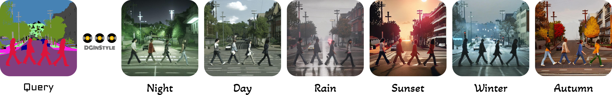

## :minidisc: DGInStyle: Domain-Generalizable Semantic Segmentation with Image Diffusion Models and Stylized Semantic Control

[[Project Page]](https://dginstyle.github.io/) | [[ArXiv]](https://arxiv.org/abs/2312.03048) |
[[Datasets]](https://drive.google.com/file/d/1e2wiwr5_wgCN3pLCQMOQvjRqQYtEozWy/view)

By [Yuru Jia](https://github.com/yurujaja),
[Lukas Hoyer](https://lhoyer.github.io/),
[Shengyu Huang](https://shengyuh.github.io/),
[Tianfu Wang](https://tianfwang.github.io/),
[Luc Van Gool](https://scholar.google.com/citations?user=TwMib_QAAAAJ&hl=en),
[Konrad Schindler](https://scholar.google.com/citations?user=FZuNgqIAAAAJ&hl=en),
[Anton Obukhov](https://www.obukhov.ai/)

We propose DGInStyle, an efficient data generation pipeline with a pretrained text-to-image latent diffusion model (LDM) at its core. The semantic segmentation models trained on our generated dataset offer improved domain generalization, drawing on the prior knowledge embedded in the LDM.

This Repository hosts the training and inference implementation for the **DGInStyle data generation pipeline**. To assess the effectiveness of the generated data, we provide [DGInStyle-SegModel](https://github.com/yurujaja/DGInStyle-SegModel), which is designed for downstream semantic segmentation tasks.



<!-- ## :hourglass: ToDo
:white_large_square: Release the guidance for DGInStyle pipeline training.

:ballot_box_with_check: Release the code and weights for the semantic segmentation models.

:ballot_box_with_check: Release demo script for fine-grained stylized conditioned image generation.

:ballot_box_with_check: Release arXiv paper. -->

## :gear: Setup
For this project, we used python/3.8.5, cuda/12.1.1. 

### Repository
Clone the repository:

```bash
git clone https://github.com/yurujaja/DGInStyle.git
cd DGInStyle
```

### Dependencies
```bash
export DGINSTYLE_PATH=/path/to/venv/dginstyle  # change this
python3 -m venv ${DGINSTYLE_PATH}
source ${DGINSTYLE_PATH}/bin/activate

pip install -r requirements.txt
```

## :desktop_computer: Inference Demo
We provide a demo inference script given some example semantic conditions. The weights are available via [HuggingFace repository](https://huggingface.co/yurujaja/DGInStyle), including the source-domain data (GTA) fine-tuned Stable Diffusion weights, ControlNet weights and SegFormer weights trained using DGInStyle. For prior-domain data (LAION-5B) pretrained Stable Diffusion weights, we adopt [RunwayML's stable-diffusion-v1-5](https://huggingface.co/runwayml/stable-diffusion-v1-5).

<!-- To directly interact with the Hugging Face Hub, you need to have a Hugging Face account with your access token, then login. 
```bash
huggingface-cli login
``` -->
We provide `example_data` so that you can preview the data created under specific semantic conditions. Please run the command given below. The output will be saved by default in the `example_data/output` folder.
```bash
python demo.py
```

### Checkpoint cache
The weights are automatically downloaded to the Hugging Face cache by default. The location of this cache can be changed by overriding the HF_HOME environment variable:

```bash
export HF_HOME=new/path   # change this
```

## :baseball: Training 
### Preparing for datasets
Following the common practice in domain generalization, we use **GTA** as the synthetic source dataset: Please download all image and label packages from [here](https://download.visinf.tu-darmstadt.de/data/from_games/) and extract them to `data/gta`. Run the following script to get dataset training file:
```bash
python -m controlnet.tools.convert_dataset_file
```
To enable rare class sampling (rcs) component, please refer to [this repository](https://github.com/yurujaja/DGInStyle-SegModel#:~:text=GTA%3A%20Please%20download%20all,py%20%20%20%23%20sample%20GTA%20subsets) to generate rcs related files.
<!-- To enable rare class sampling (rcs) component, generate rcs related files using the following script:
```bash
python -m 
``` -->

### DreamBooth fine-tuning using GTA
As a first step of our Style Swap technique, we fine-tune the original latent diffusion model's U-Net $\mathbf{U}^{\mathbf{P}}$ with the [Dreambooth protocol](https://dreambooth.github.io/) towards the source domain using all GTA images. 
```bash
python dreambooth/train_dreambooth.py \
    --pretrained_model_name_or_path='runwayml/stable-diffusion-v1-5' \
    --instance_data_dir='data/gta/images/' \
    --output_dir='path/to/your/dreambooth/output' \    # change this
    --instance_prompt='' \
    --resolution=512 \
    --train_batch_size=1 \
    --sample_batch_size=1 \
    --gradient_accumulation_steps=2 \
    --gradient_checkpointing \
    --learning_rate=2e-06 \
    --lr_scheduler=constant \
    --lr_warmup_steps=1000 \
    --max_train_steps=30000 \
    --mixed_precision=fp16 \
    --report_to=wandb \     # choose from wandb or tensorboard
    --validation_prompt='roads building sky person vegetation car' \  # change this
    --validation_steps=200 \
    --checkpointing_steps=1000
```

### ControlNet training with the source domain LDM
The above resulting U-Net $\mathbf{U}^{\mathbf{S}}$ is used as the base model instead of $\mathbf{U}^{\mathbf{P}}$ to initialize ControlNet, and still the paired source domain data is used to let the ControlNet focus primarily on the task-specific yet style-agnostic layout control.
```bash
export U_S_MODEL_DIR='path/to/your/dreambooth/output'  # change this
export OUTPUT_DIR='path/to/your/controlnet/output' # change this
export DATASET_FILE='data/gta/dataset_file.json'

accelerate launch controlnet/train.py \
    --pretrained_model_name_or_path=$MODEL_DIR \
    --inference_basemodel_path='runwayml/stable-diffusion-v1-5' \
    --output_dir=$OUTPUT_DIR \
    --dataset_file=$DATASET_FILE \
    --learning_rate=1e-05 \
    --train_batch_size=2 \
    --gradient_accumulation_steps=4 \
    --checkpointing_steps=2000 \
    --validation_steps=1000 \
    --report_to='wandb' \
    --rcs_enabled \
    --rcs_data_root='data/gta/' \
    --tracker_project_name='dginstyle_training' \
    --validate_file='controlnet/tools/example_validation.jsonl'
```

<!-- ## :floppy_disk: Generating Datasets -->


## :shamrock: Acknowledgements

This repository is based on the following open-source projects. We thank their authors for making the source code publicly available.

* [Diffusers](https://github.com/huggingface/diffusers)
* [ControlNet](https://github.com/lllyasviel/ControlNet)
* [MultiDiffusion](https://github.com/omerbt/MultiDiffusion)
* [DAFormer](https://github.com/lhoyer/DAFormer)


## :framed_picture: License

This project is released under the [Apache License 2.0](LICENSE), while some specific features in this repository are with other licenses. Please refer to [LICENSE](LICENSE) for the careful check, if you are using our code for commercial matters.

## :page_with_curl: Citation
```bibtex
@misc{jia2023dginstyle,
      title={DGInStyle: Domain-Generalizable Semantic Segmentation with Image Diffusion Models and Stylized Semantic Control}, 
      author={Yuru Jia, Lukas Hoyer, Shengyu Huang, Tianfu Wang, Luc Van Gool, Konrad Schindler, Anton Obukhov},
      year={2023},
      eprint={2312.03048},
      archivePrefix={arXiv},
      primaryClass={cs.CV}
}
```


